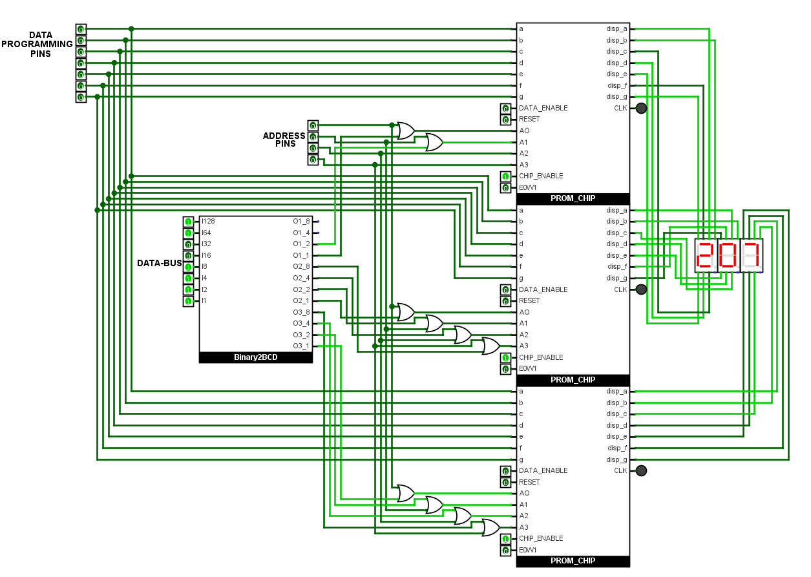

##  PROM-CHIP DECIMAL DISPAY
- Implemented an 8-bit binary to decimal display system using Programmable Read-Only Memory (PROM) chips and a Binary-to-BCD converter.
- The circuit takes an 8-bit binary input (0–255) and outputs its equivalent decimal representation on three 7-segment displays - representing the hundreds, tens, and ones digits.

  

## Binary to BCD Converter
- Implemented the conversion using Double-Dabble Algorithm.

  

