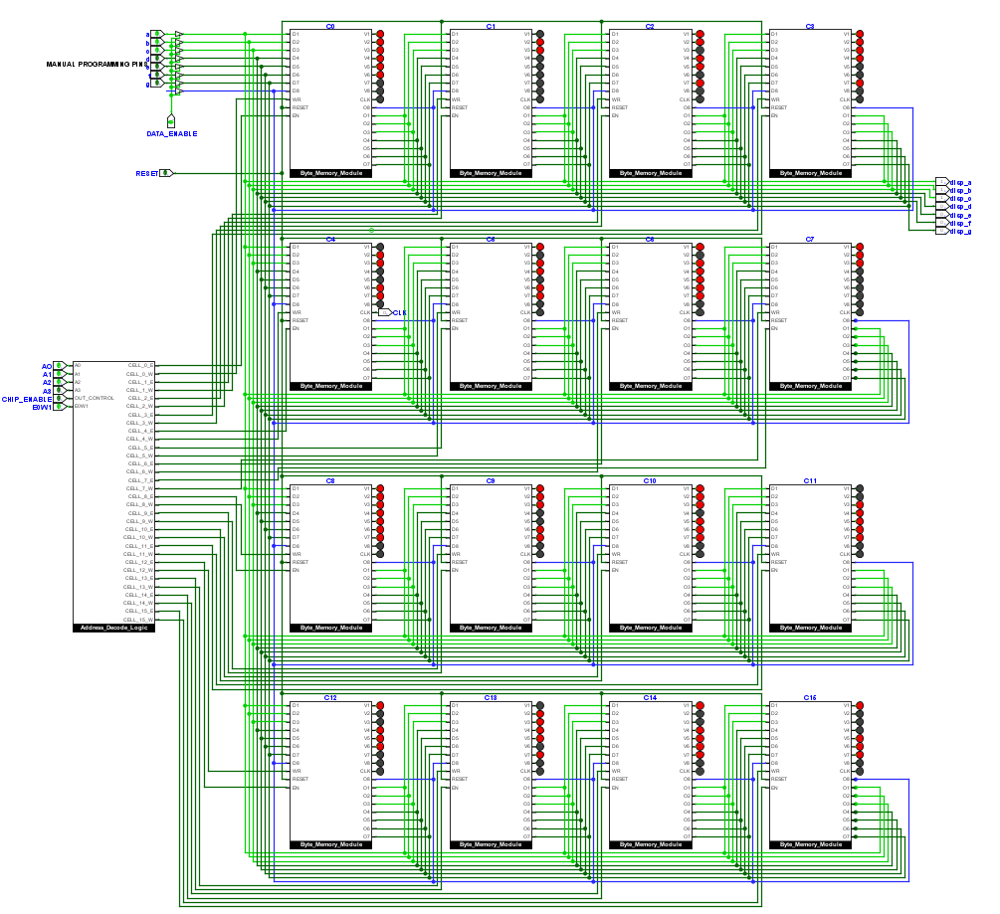

## PROM Hex-Display Decoder
- Implemented a binary-to-hex display decoder using a Programmable Read-Only Memory (PROM) chip. The PROM is programmed such that each binary value applied to its address lines corresponds to the appropriate 7-segment display output for hexadecimal digits 0–F.

  

<em>Output display showing hexadecimal values (0–F).</em>

## Features
- Built using the [Memory module](../RAM)and configured  into a Programmable ROM chip.
- It has 16 Memory cells(C0-C15), each cell capable of stroing 8 Bits of data.
- Each cell have a unique address and can be adressed using the adress decoders.
- Pins:
  - a, b, c, d, e, f, g: These pins are used to input data that can be stored in any memory cell
  - Data_Enable: It allows the data on a-g pins in the internal PROM Bus.
  - RESET: To bring the PROM chip to initial state, all storage cell data to 0.
  - Address Bits(A0-A3): 4 address bits can address 16 locations. A0 is the LSB and A3 is the MSB.
  - CHIP_Enable: If Low chip is disabled, no read or write operations can be performed.
  - E0W1: To program the chip, we need to keep this pin high.
- After addressing a memory cell and inputting the data on the internal bus we need to store the data by pulsing the clock once.
- After Programming, it can be interfaced to Hex-Display and data on address lines which will be connected to output lines keeping E0W1 low.

  

