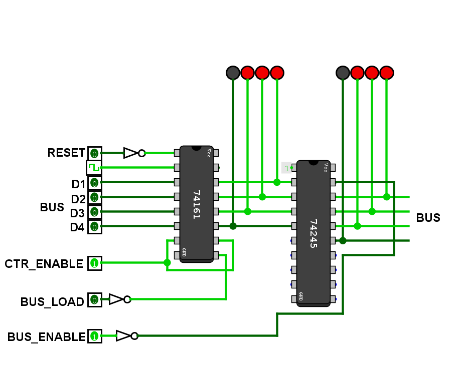

## Program Counter
- Implemeted a 4-Bit Porgram Counter using `74LS161` and `74LS245` TTL chips.
- Can be interfaced with the bus.

  

## Implementations
- Gate Implementation
- TTL Implementation

## Pins
- D1, D2, D3, D4: Data Bits which can be inerfaced with the Bus.
- CTR_ENABLE: Enable the counter to perform any operation.
- BUS_LOAD: Allow the Program counter to load the data on the bus into the program counter
- BUS_ENABLE: Allow the data in program counter onto the bus.
- RESET: To reset the data in the counter.
