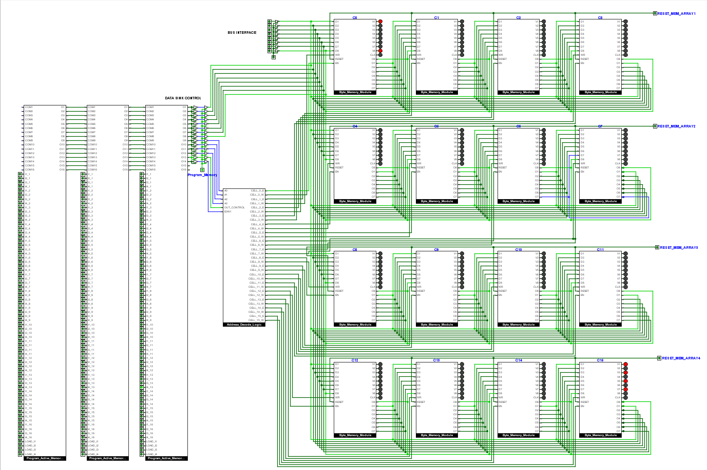

# 🏗️ 8-Bit Breadboard Computer  

## 🧠 About  
This project is my attempt to explore how computers work **fundamentally at the gate level**.  
Inspired by the Ben Eater 8-bit computer series, I aim to design and build a fully functional 8-bit CPU from scratch.  

My approach is:  
- **💻Simulation First** – Each module is first prototyped and tested in simulators like *Logisim Evolution* or *Falstad*.  
- **⚙️Hardware Implementation** – Once all modules are validated, I will implement them on a physical breadboard with real components.  

## ✅ Modules Validated  

  
   
  <b>💾 Programmable RAM - Stored Program Execution</b>

- [Clock Module](CLOCK)
- [Registers](registers_AND_bus)  
- [Bus System](registers_AND_bus)
- [ALU](ALU)
- [RAM](RAM)
- [Address Decode Logic](Address_Decoders)
- [Manually Programmable RAM](Manually_Programmable_RAM)
- [Programmable_RAM_Stored Program Execution](Programmable_RAM(StoredProgramExecution))
- [Program Counter](Program_Counter)

## 🔍 Module in Development and Testing phase
- 7 Segment Hex Display

## 🐞 Module in Debugging Phase
- [ALU Gate Implementation](Bugs)

## 📂 Project Structure  
Each module will have its own folder containing:  
- A dedicated **README.md** explaining design, features, and usage  
- **Images** of schematics, simulations, and hardware builds  

## 🎯 Goals  
- Understand computation from the ground up  
- Document the full design and build process  
- Share schematics, notes, and experiments for others to learn from  
