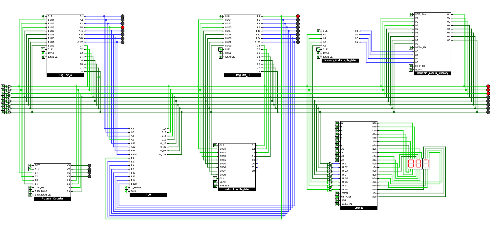
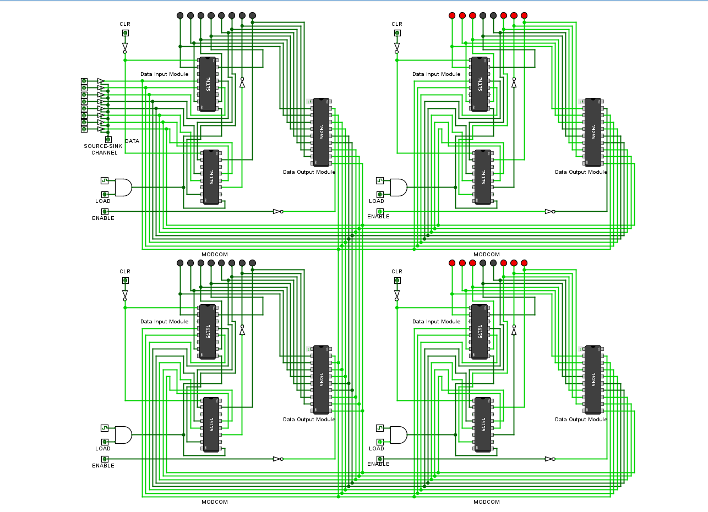
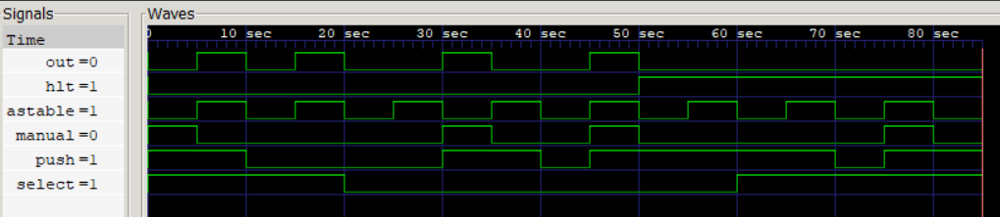

# 🏗️ 8-Bit Computer  

  
   
  </b> ⚙️ System Integration - Registers, Memory, ALU, Program Counter and Display Connected

## 🧠 About  
This project is my attempt to explore how computers work **fundamentally at the gate level**.  
I aim to design and build a fully functional 8-bit CPU from scratch.  

## 🎯My Approach: 
*Before simulation, each module is designed conceptually using hand-drawn block diagrams and written reasoning to validate the logic flow through mental simulation and small example cases. The block diagram is then refined into a rough structural, gate-level representation before being implemented, debugged, and rigorously tested in digital logic simulators such as Logisim Evolution and Falstad. Where possible, I explore multiple design approaches to achieve the same functionality, comparing behavior, complexity, and design trade-offs before finalizing an implementation.*  

## ✅ Modules Validated  
- [Clock Module](CLOCK)
- [Registers](registers_AND_bus)  
- [Bus System](registers_AND_bus)
- [ALU](ALU)
- [RAM](RAM)
- [Address Decode Logic](Address_Decoders)
- [Manually Programmable RAM](Manually_Programmable_RAM)
- [Programmable_RAM_Stored Program Execution](Programmable_RAM(StoredProgramExecution))
- [Program Counter](Program_Counter)
- [Programmable ROM - Hex Display](PROM_Chip-Hex-Display)
- [Programmable ROM - Decimal Display](PROM_Chip-Decimal-Display)
- [System Integration](System_Integration)
- [Stored Micro-Program Control](Stored_Program_Control)
  

  
   
  <b>💾 Registers & Bus System </b>

## 🔍 Verilog Implementations
- [Clock](CLOCK/CLOCK-Verilog)

  
   
  </b> Clock Module

## 📂 Project Structure  
Each module will have its own folder containing:  
- A dedicated **README.md** explaining design, features, and usage  
- **Images** of schematics, simulations, and hardware builds  

## 🎯 Goals  
- Understand computation from the ground up  
- Document the full design and build process  
- Share schematics, notes, and experiments for others to learn from
