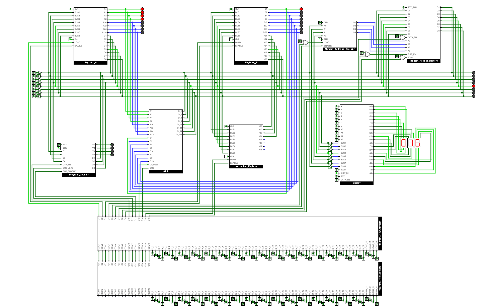

# 📦Stored Program Control
- This machine is controlled by a microprogram consisting of pre-encoded microinstructions stored in a clock-driven flowing memory. Each microinstruction advances sequentially through memory and directly drives the machine’s control and data signals when it reaches the execution interface.

   
  <strong>Figure:</strong> Flow-sequenced microprogram control memory driving the machine.

## 📐 Instruction Format
- Bit 1: Load Register A
- Bit 2: Enable Register A
- Bit 3: Load Register B
- Bit 4: Enable Register B
- Bit 5: Load Memory Address Register
- Bit 6: Enable Memory Address Register
- Bit 7: Enable Input Data Lines
- Bit 8: RAM Chip Enable
- Bit 9: E0W1
- Bit 10: Enable Program Counter Operation
- Bit 11: Load Program Counter
- Bit 12: Enable Program Counter
- Bit 13: Enable ALU
- Bit 14: SUB
- Bit 15: Load Instruction Register
- Bit 16: Enable Instruction Register

## 🧮Program Memory
- The pins on Program active memory are labelled as Ix_y, where x is the instruction number and y is the instruction bit, each program memory module has capacity of storing 4 instructions(16 bit each), hence 8 Bytes. In the circuit provided 2 such modules have been connected giving us ability to store 16 bytes, even though more modules can be connected together to get more memory to store a program.
- Each Program Memory is made up of 4 sets of 16 D-flip flops, the set of D-flip flops connected directly to machine is called the Interface module, as it acts as an interface between machine and memory and the instruction that interface module holds is getting executed. 
- Sets of D-flip flops are Connected in such a way that after loading the program and initiating it, the instructions keep flowing from one D-flip flop set to the next getting to the interface module and controlling the machine when it has to.

## 🧰Loading the Program
- Each instruction has to be entered manually through the initial load pins, then make Load_Ix pin high and the instruction will be stored.
- Make sure to remove instruction from initial load pins after loading it in the memory, if not program will keep executing that instruction.
- Same steps have to be followed for further instruction loading
- Ix_y, x=1,2,3,4 is the sequence in which instuctions will be executed

## 👉 More of Stored Program Architecture
- Refer [This](https://github.com/KARAN-D05/Computing_Machinery_from_Scratch/tree/main/RAM_V4)-> Autonomous Custom Built Arithmetic Machine Version-4
