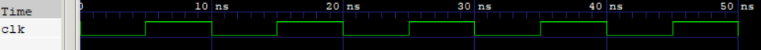

# 💻HDL IMPLEMENTATIONS
- Implementing all the modules of the 8-Bit computer in Verilog step by step, and finally integrated them into a complete working design.

## 🎯My Approach
- To rigorously test the modules using testbenches to ensure correctness before integration.

## 🛠️Tools Used
- Icarus Verilog -> Simulation
- GtkWave -> Waveform Analysis
- VS-Code -> Code editing and organization

## ✅Modules Implemented
- [Clock](CLOCK)

  
   
  <b> Clock

